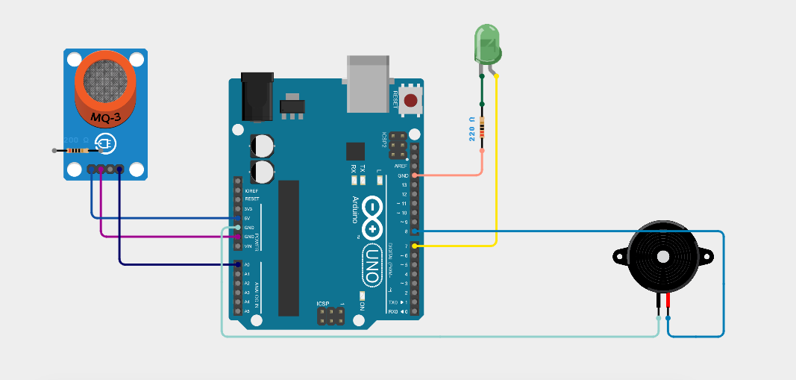
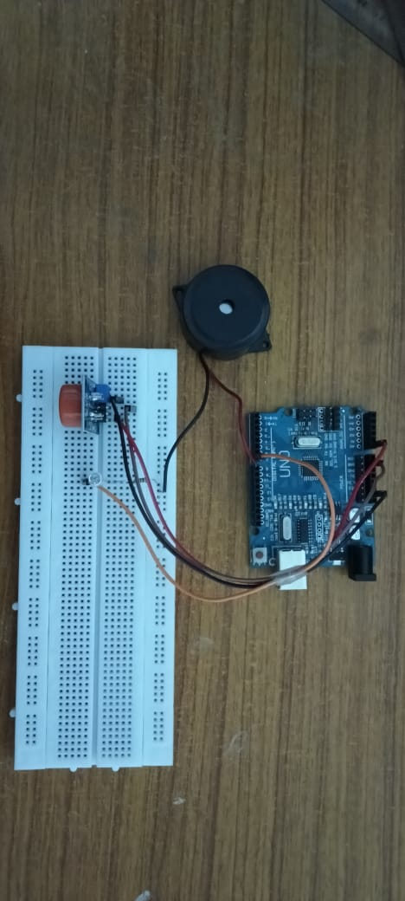

**Smart Helmet**

An Arduino-based smart helmet system for detecting alcohol presence using an MQ-3 alcohol sensor and providing an alert through a buzzer.

**Project Overview**

The Smart Helmet is a safety-oriented system designed to detect alcohol presence near the rider. The MQ-3 alcohol sensor senses alcohol vapour and the Arduino Uno processes the sensor signal. When alcohol is detected above the defined threshold, the buzzer is activated as an alert.

**Objectives**

- Detect the presence of alcohol using an MQ-3 sensor.
- Process the sensor output using Arduino Uno.
- Provide an immediate alert using a buzzer.
- Improve rider safety by providing an alcohol detection mechanism.

 **Components Used**

- Arduino Uno
- MQ-3 Alcohol Sensor
- Buzzer
- Connecting wires
- Breadboard
- Power supply

**Working Principle**

1. The MQ-3 sensor detects alcohol vapour.
2. The sensor provides an output signal to the Arduino Uno.
3. Arduino reads and processes the sensor value.
4. When the detected alcohol level exceeds the set threshold, the buzzer is activated.
5. The buzzer provides an audible warning indicating the detection of alcohol.

 **Circuit Diagram**

The circuit diagram shows the connections between the Arduino Uno, MQ-3 alcohol sensor and buzzer.

**Source Code**

The Arduino source code is available in the "src" folder.

**Results**

The system successfully detects the presence of alcohol using the MQ-3 sensor and activates the buzzer when the detected level crosses the defined threshold.

 **Applications**

- Rider safety systems
- Alcohol detection systems
- Smart vehicle safety applications
- Educational IoT and embedded-system projects

 **Future Scope**

- Integrate the system with a helmet-wearing detection mechanism.
- Add wireless communication for remote alerts.
- Add a vehicle ignition control mechanism.
- Improve alcohol-level measurement and calibration.

 **Conclusion**

The Smart Helmet demonstrates a simple and effective alcohol detection system using Arduino Uno, an MQ-3 alcohol sensor and a buzzer. The prototype successfully detects alcohol presence and provides an immediate audible alert.
